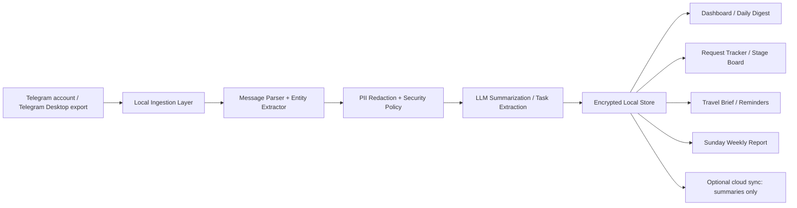

# Telegram BizOps Copilot 기획서

부제: 포커 온라인 게임 사업 운영용 텔레그램 업무 요약, 진행상황 추적, 요청 누락 방지, 출장 브리프, 주간 보고 자동화

작성일: 2026-03-15
작성 기준: 사용자 개인 운영 툴, 보안 우선, 텔레그램 대화 중심 업무 환경

## 1. 기획 목적

포커 온라인 게임 사업을 운영하면서 텔레그램에서 대부분의 업무가 오간다.

문제는 다음과 같다.

- 컨택하고 관리하는 부서와 파트너가 너무 많다.
- 어떤 대화가 오갔는지, 지금 어느 단계인지 자주 헷갈린다.
- 상대가 요청한 사항을 놓치는 경우가 있다.
- 출장과 비즈니스 미팅 일정이 대화 속에 흩어져 있어 챙기기 어렵다.
- 매주 일요일 정기 보고를 해야 하는데, 내용을 다시 모으는 데 시간이 많이 든다.

이 기획의 목표는 텔레그램 대화를 자동으로 읽어 "대표 개인용 운영 보조 시스템"으로 바꾸는 것이다.

## 2. 한 줄 결론

이 용도에는 `서버가 내 텔레그램 계정을 대신 들여다보는 SaaS`보다 `내 PC에서 돌아가는 로컬 우선 BizOps Copilot`이 가장 적합하다.

추천 구조는 다음과 같다.

- 과거 대화 백필: Telegram Desktop Export
- 일상 운영 자동화: 로컬 에이전트가 내 텔레그램 계정 대화를 주기적으로 분석
- 결과 저장: 로컬 암호화 DB 중심
- 클라우드에는 원문이 아니라 요약, 작업, 스테이지, 일정만 선택적으로 동기화

이 방식이 좋은 이유는 다음과 같다.

- 내 1:1 대화와 그룹 대화를 실제 운영 수준으로 커버할 수 있다.
- Bot API만으로는 부족한 범위를 보완할 수 있다.
- 개인 계정 세션을 외부 서버에 두지 않아 보안 리스크를 크게 줄일 수 있다.
- 요청 누락 방지, 출장 리마인드, 일요일 보고 자동화를 한 흐름으로 묶을 수 있다.

## 3. 대상 업무 범위

이 시스템은 아래 성격의 대화를 관리 대상으로 둔다.

- 파트너사 협의
- 에이전트/어필리에이트 커뮤니케이션
- 마케팅/광고/크리에이티브 협의
- 플랫폼/개발/운영 이슈
- 결제/정산/벤더 커뮤니케이션
- VIP/핵심 거래처 대응
- 내부 팀 지시/확인
- 투자자/이해관계자 커뮤니케이션
- 출장/미팅 일정 관련 대화

## 4. 핵심 문제 정의

### 4.1 기억의 문제

대표가 직접 많은 대화를 처리하면 대화별 맥락과 약속 사항이 머릿속에서 섞이기 쉽다.

### 4.2 스테이지 관리 문제

누가 지금 `초기 접촉`, `제안 검토`, `조건 협상`, `내 답변 대기`, `상대 답변 대기`, `실행 중`, `보류`인지 빠르게 안 보인다.

### 4.3 요청 누락 문제

상대가 요구한 자료, 회신, 확인 사항, 계약 관련 요청, 가격 확인, 일정 확정 등이 텔레그램 대화 속에 묻혀서 빠진다.

### 4.4 출장 준비 문제

출장 관련 정보가 텔레그램 메시지에 흩어져 있으면 항공, 호텔, 미팅 상대, 준비사항, 현지 일정이 따로 관리되지 않는다.

### 4.5 주간 보고 문제

일요일 보고용으로 한 주의 협상 진척, 막힌 이슈, 핵심 지표, 다음 주 액션을 다시 모으는 데 시간이 많이 든다.

## 5. 제품 컨셉

이 시스템은 단순 요약기가 아니라 `대표 개인용 BizOps Copilot`이다.

핵심 역할은 아래 다섯 가지다.

1. 대화를 읽고 핵심 업무를 구조화한다.
2. 각 대화 상대와 이슈의 현재 스테이지를 추적한다.
3. 상대 요청과 내 약속을 To-do로 올려 누락을 막는다.
4. 출장/미팅 관련 문맥을 묶어 미리 알려준다.
5. 매주 일요일 보고서를 자동으로 만든다.

## 6. 핵심 기능

### 6.1 Conversation Intelligence

- 대화별 핵심 요약 생성
- 상대방, 회사, 부서, 국가, 주제 자동 태깅
- 중요한 수치, 날짜, 조건, 약속 추출
- "이번 대화에서 결정된 것"과 "아직 안 끝난 것" 분리

### 6.2 Stage Tracker

각 대화 또는 계정을 아래 공통 스테이지로 자동 분류한다.

- `new_contact`
- `initial_discussion`
- `requirements_received`
- `proposal_or_terms_sent`
- `negotiation`
- `waiting_on_me`
- `waiting_on_them`
- `approved_ready`
- `executing_live`
- `blocked`
- `dormant`
- `closed`

이 스테이지는 파트너, 벤더, 내부팀, 투자자 커뮤니케이션에도 공통적으로 적용 가능하게 설계한다.

### 6.3 Request Capture

텔레그램 대화에서 아래 항목을 자동으로 뽑아낸다.

- 상대가 나에게 요청한 일
- 내가 상대에게 약속한 일
- 특정 날짜가 있는 할 일
- 회신이 필요한 메시지
- 반복해서 언급되는 미해결 이슈

각 요청은 별도 작업 항목으로 승격한다.

필수 필드:

- 요청 내용
- 요청자
- 관련 대화
- 관련 회사/부서
- 마감일
- 현재 상태
- 우선순위
- 놓치면 안 되는 이유

### 6.4 Travel & Meeting Copilot

출장 관련 메시지를 탐지해 구조화한다.

- 도시/국가
- 출발일/복귀일
- 미팅 상대
- 미팅 목적
- 준비해야 할 자료
- 현지에서 처리해야 할 업무
- 출국 전 확인 항목

자동 알림 예시:

- 출장 확정 직후: "이번 출장 목적/주요 미팅/준비 문서 요약"
- 출국 7일 전: "아직 미확정인 미팅과 준비물"
- 출국 3일 전: "확정 일정, 챙길 자료, 미응답 상대"
- 출국 1일 전: "최종 브리프"
- 귀국 후 1일 내: "출장 후속 액션 정리"

### 6.5 Sunday Weekly Report

매주 일요일 정해진 시간에 자동으로 주간 운영 보고서를 만든다.

권장 기본값:

- 실행 시각: 매주 일요일 12:00 KST
- 분석 범위: 직전 월요일 00:00부터 일요일 실행 시각 직전까지

보고서 구성:

- 이번 주 핵심 요약
- 부서/파트너별 진행 현황
- 새로 열린 이슈
- 해결된 이슈
- 아직 대기 중인 요청
- 대표가 답해야 할 메시지
- 다음 주 최우선 액션 5개
- 리스크 및 병목
- 출장/미팅 예정 사항

## 7. 포커 사업 맞춤형 분류 체계

### 7.1 대화 주체 카테고리

- `partner`
- `affiliate`
- `marketing`
- `operations`
- `payments`
- `vendor`
- `internal_team`
- `investor`
- `vip_client`
- `legal_compliance`
- `other`

### 7.2 업무 이슈 카테고리

- 제휴/딜 협의
- 유입/마케팅
- 캠페인 집행
- 정산/수수료
- 개발 요청
- 운영 장애
- 리스크 이슈
- 법무/정책 검토
- 계약/문서 회신
- 이벤트/프로모션
- VIP 대응
- 출장/현장 미팅

### 7.3 요청 상태

- `new`
- `acknowledged`
- `in_progress`
- `waiting_external`
- `waiting_internal`
- `done`
- `cancelled`
- `missed_risk`

## 8. 추천 시스템 구조

## 9. 권장 수집 방식

### 9.1 기본 전략

가장 추천하는 건 `로컬 우선 하이브리드`다.

1. 초기 구축
   Telegram Desktop Export로 과거 대화를 가져온다.

2. 일상 운영
   로컬 에이전트가 내 PC에서 텔레그램 데이터를 주기적으로 읽어 분석한다.

3. 보조 입력
   중요한 대화는 수동 태그 또는 단축 명령으로 즉시 "추적 대상"으로 올린다.

### 9.2 왜 Bot API 단독이 아닌가

Bot API는 유용하지만, 대표 개인 계정 기준 운영 대화를 전부 커버하기 어렵다.

특히 아래 한계가 있다.

- 내가 이미 텔레그램 개인 계정으로 하고 있는 1:1 대화 전체 커버가 어렵다.
- 상대를 봇으로 옮기기 힘든 경우가 많다.
- 기존 관계망을 Bot 중심 구조로 바꾸기 어렵다.

따라서 이번 용도에서는 Bot API를 메인보다 보조 도구로 보는 편이 맞다.

### 9.3 왜 원격 서버 상시 로그인 구조를 비추천하는가

- 내 개인 계정 세션 탈취 리스크가 크다.
- 거래처, 파트너, 내부 대화가 모두 한 번에 노출될 수 있다.
- 텔레그램 계정과 비즈니스 운영 데이터가 과도하게 결합된다.
- 민감한 재무/계약/협상 정보가 서버에 쌓이기 쉽다.

같은 이유로, 사용자 계정 기반 자동화가 필요하더라도 `내 장비에서만 실행`하는 로컬 구조가 훨씬 안전하다.

## 10. 보안 설계

### 10.1 기본 원칙

- 원문 메시지는 로컬 장비에만 저장
- 로컬 저장소 전체 암호화
- 외부 AI에는 원문 전체 대신 마스킹된 텍스트만 전달
- 클라우드 동기화는 기본 비활성화
- 동기화 시에도 요약/할 일/스테이지/일정만 보냄
- 첨부파일 자동 업로드는 기본 비활성화

### 10.2 권장 저장 정책

- raw messages: 14~30일 보관 후 자동 삭제
- summaries / tasks / stages / trip briefs / weekly reports: 장기 보관 가능
- attachments metadata: 기본 보관 가능
- attachments binary: 수동 승인 시만 저장

### 10.3 마스킹 대상

- 전화번호
- 이메일
- 계좌/지갑/카드 정보
- 실명과 닉네임 매핑
- 계약 금액, 수익 수치, 정산 정보 중 고위험 값
- 여권/항공권/예약번호
- 내부 민감 문서 명칭

### 10.4 운영 보안

- AI API 키는 OS keychain 또는 암호화된 secret store에 저장
- 보고서 내보내기 시 비밀번호 또는 로컬 사용자 인증 요구
- "민감 대화 제외" 기능 제공
- 어떤 메시지가 언제 AI 분석에 사용되었는지 로그 남김

## 11. 데이터 모델 제안

핵심 엔터티는 아래 정도면 충분하다.

- `contacts`
  - 이름, 회사, 역할, 카테고리, 중요도
- `conversations`
  - chat id, 타입, 관련 회사, 최근 상태, 현재 스테이지
- `messages_raw`
  - 원문, 시간, 발신자, TTL
- `summaries`
  - 일별/주별/대화별 요약
- `requests`
  - 요청 내용, 요청자, due date, 상태, 위험도
- `commitments`
  - 내가 약속한 일, 근거 메시지, 상태
- `entities`
  - 회사, 캠페인, 딜, 국가, 도시, 이벤트
- `trips`
  - 출장 목적, 기간, 미팅 리스트, 준비사항, 후속 액션
- `reports`
  - 일요일 보고서와 과거 아카이브
- `audit_events`
  - 분석/내보내기/삭제 이력

## 12. 출력 문서 설계

### 12.1 Daily Digest

매일 아침 또는 저녁에 보는 짧은 운영 브리프

- 어제 새로 생긴 일
- 답장 안 한 중요한 대화
- 오늘 마감 요청
- 스테이지가 바뀐 대화
- 리스크 높은 항목

### 12.2 Stakeholder Brief

특정 상대 또는 회사별 요약 카드

- 최근 대화 요약
- 현재 스테이지
- 마지막 결정 사항
- 기다리는 항목
- 내가 다음에 해야 할 일
- 최근 톤과 긴급도

### 12.3 Request Register

놓치면 안 되는 요청을 한 군데서 보는 레지스터

- overdue
- 오늘 처리할 일
- 이번 주 처리할 일
- 상대별 요청 묶음

### 12.4 Trip Brief

출장/현장 미팅용 문서

- 누구를 왜 만나는지
- 아직 확정 안 된 일정
- 가져갈 자료
- 출장 중 꼭 처리해야 할 일
- 귀국 후 follow-up

### 12.5 Sunday Weekly Report

대표 보고 또는 자기 점검용 주간 보고서

- 이번 주 성과
- 협상 진척
- 정산/운영/리스크 이슈
- 부서별 상태 요약
- 누락 위험 항목
- 다음 주 우선순위

## 13. UX 제안

### 13.1 메인 화면

- `Today`
- `Waiting On Me`
- `Waiting On Them`
- `Travel`
- `Sunday Report`

### 13.2 핵심 보드

- Stage Board
- Request Inbox
- Stakeholder Map
- Trip Timeline

### 13.3 빠른 액션

- "이 대화 추적 시작"
- "이 대화는 민감해서 제외"
- "이 메시지에서 할 일 만들기"
- "이번 출장으로 묶기"
- "일요일 보고 초안 지금 만들기"

## 14. 알림 전략

알림은 너무 많으면 망하므로 아래 네 종류만 강하게 추천한다.

### 14.1 응답 누락 알림

- 중요한 상대에게 24시간 이상 답이 없는 경우
- 내가 답하기로 했는데 후속 메시지가 없는 경우

### 14.2 마감 임박 알림

- 오늘 마감
- 24시간 내 마감
- 이미 늦은 요청

### 14.3 출장 알림

- 출국 7일 전
- 출국 3일 전
- 출국 1일 전
- 귀국 후 follow-up 정리

### 14.4 주간 보고 알림

- 일요일 보고 초안 생성 완료
- 보고 전에 빠진 항목 검토 요청

## 15. AI 처리 정책

### 15.1 분석 파이프라인

1. 규칙 기반 추출
   날짜, 금액, 회사명, 도시명, 항공/호텔 패턴, 요청형 문장 탐지

2. LLM 분석
   요약, 스테이지 분류, 요청 추출, 리스크 탐지, 출장 브리프 생성

3. 후처리
   JSON 스키마 검증, 중복 제거, confidence score 계산

### 15.2 중요한 원칙

- AI 결과는 "사실"과 "추론"을 구분해서 저장
- 확신이 낮으면 자동 완료하지 않고 "검토 필요"로 둠
- 대화 한 줄로 큰 결론을 내리기보다 누적 문맥을 함께 사용

## 16. 구현 로드맵

### Phase 1: 2주 MVP

목표:

- 일요일 보고와 요청 누락 방지부터 해결

범위:

- Telegram Desktop Export 입력
- 파서 + 태깅 + 요약
- Request Register
- Sunday Weekly Report
- 간단한 Trip Brief

성과 기준:

- 일요일 보고 작성 시간 80% 감소
- 놓친 요청 건수 체감 감소
- 대화별 현재 상태를 한 화면에서 확인 가능

### Phase 2: 3~5주 운영형

목표:

- 실시간성 확보

범위:

- 로컬 에이전트 도입
- 증분 분석
- Daily Digest
- Stage Board
- 응답 누락 알림
- 출장 알림 고도화

성과 기준:

- 하루 2회 이상 대시보드 확인
- 중요한 대화 누락 50% 이상 감소

### Phase 3: 4주+ 확장형

목표:

- 대표 운영 OS 수준으로 확장

범위:

- 캘린더 연동
- 문서/파일 연결
- 대화 상대별 long-term brief
- 외부 공유용 보고서 버전
- 모바일 뷰어

## 17. 추천 기술 스택

### MVP

- Python 3.11+
- Telegram Desktop Export JSON
- SQLite + SQLCipher 또는 로컬 Postgres
- LLM API
- Markdown / DOCX 출력

### 운영형

- 로컬 데스크톱 에이전트
- TDLib 기반 수집 또는 안전한 로컬 증분 인덱싱
- FastAPI 또는 Electron + local service
- scheduler
- OS notifications

## 18. 성공 지표

- 놓친 요청 수
- overdue 요청 수
- 상대 대화의 현재 스테이지 식별 정확도
- 일요일 보고 작성 시간
- 출장 전 준비 누락 건수
- 대표가 수동으로 대화를 다시 검색하는 횟수

## 19. 리스크와 대응

### 리스크 1: 과도한 자동 추론

대응:

- 신뢰도 점수 표시
- 수동 수정 가능
- 중요한 항목은 검토 후 확정

### 리스크 2: 민감 대화 유출

대응:

- 로컬 우선
- 마스킹
- 원문 TTL
- 첨부파일 기본 비활성화

### 리스크 3: 알림 피로도

대응:

- 알림 유형 최소화
- 중요도 기반 발송
- snooze 기능 제공

### 리스크 4: 분류 체계가 실제 운영과 안 맞음

대응:

- 초기에 사용자 맞춤 태그와 스테이지 조정
- 2주 운영 후 taxonomy 수정

## 20. 최종 추천안

현재 사용자 상황에는 아래 조합이 가장 적합하다.

- `로컬 우선`
- `Telegram Desktop Export로 시작`
- `그 다음 로컬 자동 분석으로 확장`
- `원문 대신 구조화 결과 중심 저장`
- `핵심 목표는 요약보다 요청 누락 방지와 주간 보고 자동화`

즉, 이 시스템의 가장 중요한 산출물은 예쁜 요약이 아니라 아래 네 가지다.

- 지금 내가 답해야 하는 것
- 각 상대와 딜이 어느 단계인지
- 다가오는 출장과 미팅에서 놓치면 안 되는 것
- 일요일 보고서 초안

## 21. 다음 단계

실행은 아래 순서로 가는 것이 좋다.

1. 스테이지 체계와 카테고리를 사용자 업무 방식에 맞게 1차 확정
2. 실제 텔레그램 Export 2~3개로 샘플 분석
3. Sunday Report 포맷 먼저 고정
4. Request Register와 Trip Brief를 붙여 MVP 완성
5. 만족도가 나오면 로컬 자동 분석으로 확장

## 22. 참고 자료

최신 확인일: 2026-03-15

- Telegram Bot API: [https://core.telegram.org/bots/api](https://core.telegram.org/bots/api)
- Telegram Bots / Business bots: [https://core.telegram.org/api/bots](https://core.telegram.org/api/bots)
- Connected business bots: [https://core.telegram.org/api/bots/connected-business-bots](https://core.telegram.org/api/bots/connected-business-bots)
- Business bot recipients: [https://core.telegram.org/type/BusinessBotRecipients](https://core.telegram.org/type/BusinessBotRecipients)
- TDLib: [https://core.telegram.org/tdlib](https://core.telegram.org/tdlib)
- Telegram Desktop export reference: [https://bugs.telegram.org/c/60](https://bugs.telegram.org/c/60)

참고 해석:

- Bot API와 business bot은 특정 범위의 실시간 자동화에 유용하지만, 대표 개인 계정 중심의 광범위한 1:1 운영 대화 전체를 메인 수집 수단으로 삼기엔 한계가 있다.
- TDLib는 공식 라이브러리이지만, 사용자 계정 자동화는 보안상 로컬 장비에 한정하는 편이 바람직하다.
- Telegram Desktop export는 과거 대화 백필과 안전한 초기 MVP 구축에 적합하다.
