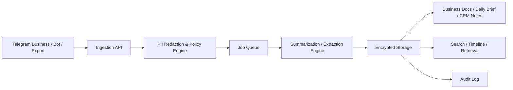

# Telegram 업무 요약/정리/비즈니스 문서화 기능 기획서

작성일: 2026-03-15

## 1. 한 줄 결론

가장 안전하고 현실적인 방식은 `Telegram Business + Connected Business Bot`을 실시간 수집의 기본 경로로 두고, 과거 대화나 개인 대화는 `Desktop export 업로드` 또는 `수동 포워드`로 보완하는 하이브리드 구조다.

반대로, 개인 텔레그램 계정 전체를 서버에서 직접 로그인해 읽는 방식(TDLib/MTProto 기반 원격 세션 수집)은 기능적으로는 가능할 수 있어도 보안 리스크와 운영 리스크가 커서 이 기능의 기본 전략으로 추천하지 않는다.

## 2. 만들고자 하는 기능

사용자의 텔레그램에서 진행 중인 일을 자동으로 정리해 아래 결과물로 바꾼다.

- 오늘의 진행 상황 요약
- 사람/회사/딜/이슈별 정리 문서
- 해야 할 일과 후속 액션 리스트
- 일정/의사결정/리스크 추출
- 주간 비즈니스 메모
- 누적 관계 히스토리와 컨텍스트 카드

핵심 가치는 "대화 로그"를 "업무 자산"으로 바꾸는 것이다.

## 3. 전제와 제약

Telegram 공식 문서 기준으로, 일반 Bot API는 사용자가 봇과 직접 대화한 메시지나 봇이 들어간 채팅의 허용된 범위만 받을 수 있다. 따라서 봇만으로 사용자의 텔레그램 전체 개인 대화를 임의로 읽는 제품은 만들기 어렵다.

또한 Telegram Business 계정은 비즈니스 봇을 연결해 특정 채팅을 봇이 대신 처리하게 할 수 있다. 이 방식은 실시간 업무 자동화에 가장 적합하다.

정리하면:

- "업무용 텔레그램 대화"를 실시간 요약하고 싶다 -> Business Bot이 최적
- "내 개인 텔레그램 전체"를 안전하게 정리하고 싶다 -> 서버 수집보다 로컬 처리 또는 export 업로드가 안전

## 4. 고려한 방식 비교

| 방식 | 실시간성 | 커버리지 | 보안 리스크 | 운영 난이도 | 추천도 |
|---|---|---:|---:|---:|---:|
| Telegram Business Connected Bot | 높음 | 업무 대상 채팅 중심 | 낮음~중간 | 중간 | 가장 추천 |
| 일반 Bot + 수동 포워드/명령어 | 중간 | 사용자가 넘긴 대화만 | 낮음 | 낮음 | MVP 추천 |
| Telegram Desktop export 업로드 | 낮음 | 과거 기록/선택 대화 | 낮음 | 중간 | 보완 수단 추천 |
| 사용자 계정 원격 로그인(TDLib/MTProto) | 높음 | 매우 넓음 | 높음 | 높음 | 기본 전략 비추천 |

## 5. 권장 제품 전략

### 5.1 추천 아키텍처

`하이브리드 2트랙`으로 간다.

1. 실시간 트랙
   Telegram Business Connected Bot 또는 일반 Bot을 통해 새 대화를 받는다.

2. 기록 보강 트랙
   과거 대화는 Telegram Desktop export 파일 업로드 또는 사용자의 수동 포워드로 가져온다.

이렇게 하면 실시간성과 보안을 동시에 잡을 수 있다.

### 5.2 왜 이 방식이 가장 좋은가

- 개인 텔레그램 세션을 서버에 저장하지 않아도 된다.
- 사용자가 명시적으로 허용한 채팅만 수집할 수 있다.
- 실시간 요약과 누적 문서화가 가능하다.
- 과거 대화 백필(backfill)도 가능하다.
- 기업 고객에게 설명하기 쉬운 보안 구조가 된다.

## 6. 권장 사용자 시나리오

### 시나리오 A: 창업자/영업 대표

- 고객, 파트너, 투자자와 텔레그램으로 대화
- 봇이 대화를 읽고 "오늘의 딜 현황", "후속 액션", "위험 신호" 문서를 자동 생성
- 특정 사람별 브리프를 누적 관리

### 시나리오 B: 운영 팀

- 여러 담당자가 텔레그램으로 인입 문의 처리
- 고객 이슈, 약속 일정, 결제 관련 문맥을 자동 태깅
- 내부 핸드오프 문서와 주간 운영 리포트 자동 생성

### 시나리오 C: 개인 사용자의 프라이버시 우선 모드

- 사용자가 특정 대화만 export 하거나 포워드
- 서버는 최소 데이터만 보관
- 민감한 원문은 빠르게 폐기하고 요약/액션 아이템만 남김

## 7. 추천 기능 범위

### 7.1 MVP

- 텔레그램 메시지 수집
- 대화별 일일 요약
- 액션 아이템 추출
- 사람/회사/주제 태깅
- 중요한 결정사항 추출
- "업무 문서" 자동 생성
  - Daily Brief
  - Conversation Memo
  - Account/Partner Note
- 검색 가능한 타임라인
- 민감정보 마스킹
- 보관 기간 설정

### 7.2 V2

- 음성/이미지/OCR 요약
- 리마인더와 캘린더 동기화
- CRM 스타일 파이프라인
- deal health score
- 팀 협업 코멘트
- 승인 후만 장기 보관하는 메모리

### 7.3 V3

- 사내 위키/Notion/Google Docs 동기화
- 고객별 브리프 자동 업데이트
- 회의 전 "컨텍스트 팩" 자동 생성
- 영업/운영 KPI 리포트

## 8. 비추천 방식과 이유

### 8.1 사용자 계정 세션을 서버에 저장하는 방식

이 방식은 피하는 것이 좋다.

이유:

- 사실상 사용자의 텔레그램 클라이언트를 서버가 대신 운영하게 된다.
- 세션 탈취 시 피해 범위가 매우 크다.
- 개인 대화, 업무 외 대화까지 과도하게 접근하게 되기 쉽다.
- 내부 통제, 감사, 고객 신뢰 설명이 어려워진다.

정확히 말하면 TDLib 자체는 공식 라이브러리이고 로컬 데이터 암호화 기능도 제공한다. 하지만 이 사실이 "원격 서버에서 개인 계정을 항상 로그인 상태로 유지하는 제품"을 안전하게 만들어 주지는 않는다. 여기서는 기술 가능성과 제품 권장안을 분리해서 봐야 한다.

## 9. 권장 시스템 구조

### 핵심 구성요소

- Ingestion API
  - webhook 수신
  - manual forward 수신
  - export file 업로드 수신
- Policy Engine
  - 채팅별 수집 허용 여부
  - 민감정보 마스킹
  - 보관 기간 적용
- Summarization Engine
  - 요약
  - 액션 아이템 추출
  - 엔터티 추출
  - 리스크 분류
- Document Engine
  - 일일 브리프
  - 사람/회사 노트
  - 비즈니스 상태 문서
- Security Layer
  - 암호화
  - 감사 로그
  - 접근제어
  - 키 관리

## 10. 데이터 수집 원칙

다음 원칙이 중요하다.

### 10.1 명시적 옵트인

- 전체 계정 단위 수집 금지
- 채팅 단위 또는 폴더 단위 옵트인
- 수집 대상 목록을 사용자가 언제든지 확인/해제 가능

### 10.2 최소 수집

- 원문 전체를 영구 저장하지 않는다.
- 기본값은 "원문 단기 보관 + 구조화 결과 장기 보관"이다.
- 첨부파일은 기본 비활성화 또는 별도 동의 필요

### 10.3 최소 전송

- 외부 LLM 호출 전 민감정보 제거
- 가능하면 요약용 canonical text만 전송
- 원문 대신 redacted text 또는 chunk digest 사용

### 10.4 사용자 통제

- "이 채팅은 요약 제외"
- "이 대화는 저장 없이 즉시 요약만"
- "90일 후 원문 삭제"
- "장기 메모리 반영 전 승인"

## 11. 보안 설계 원칙

### 11.1 절대 원칙

- 봇 토큰, API 키, 세션 키는 KMS/HSM 또는 클라우드 secret manager에 저장
- DB 컬럼 암호화 적용
- 첨부파일은 object storage + server-side encryption
- 관리자도 원문 전체를 기본 조회할 수 없도록 RBAC 분리
- 모든 조회/내보내기/삭제를 audit log에 남김

### 11.2 권장 보관 정책

- raw message: 7~30일 TTL
- summary/action items/entity graph: 장기 보관 가능
- attachments: 기본 off 또는 7일 TTL
- LLM request/response logs: 비활성화 또는 마스킹 후 짧은 TTL

### 11.3 민감정보 마스킹 범위

- 전화번호
- 이메일
- 계좌/카드/지갑 주소
- 주민등록/여권/사업자 번호
- 비밀번호/OTP/인증코드
- 주소/배송지
- 계약 금액 중 고위험 패턴

### 11.4 고보안 모드

보안이 특히 중요하면 다음 옵션을 둔다.

- 외부 LLM 대신 사내 모델 또는 전용 VPC 추론
- export 분석을 사용자 PC에서 먼저 수행
- 서버에는 요약 결과만 업로드
- 첨부파일 OCR 완전 비활성화

## 12. 문서화 결과물 설계

이 기능은 단순 요약이 아니라 문서화가 핵심이다.

### 12.1 자동 생성 문서 종류

- Daily Brief
  - 오늘 새로 생긴 일
  - 대기 중인 일
  - 긴급 리스크
  - 내일 팔로업
- Conversation Memo
  - 상대방
  - 논의 주제
  - 결정사항
  - 다음 액션
- Account / Partner Brief
  - 관계 히스토리
  - 현재 단계
  - 예산/니즈/장애요소
  - 최근 감정 톤
- Weekly Business Review
  - 리드 현황
  - 협상 진행
  - 주요 병목
  - 다음 주 우선순위

### 12.2 추출해야 할 구조 데이터

- people
- companies
- deals
- tasks
- deadlines
- promised follow-ups
- prices/budgets
- risks
- decisions
- sentiment / urgency

## 13. 추천 저장 모델

최소 아래 엔터티가 있으면 좋다.

- `telegram_connections`
  - 연결 유형, 연결 상태, 권한 범위, 마지막 동기화
- `telegram_chats`
  - chat id, title, source type, opted-in 여부
- `telegram_messages_raw`
  - 단기 TTL 원문
- `telegram_message_redactions`
  - 어떤 데이터가 마스킹되었는지 기록
- `conversation_summaries`
  - 일별/주별/대화별 요약
- `business_entities`
  - 사람, 회사, 딜, 이슈
- `action_items`
  - owner, due date, status
- `business_documents`
  - Daily Brief, Account Brief, Weekly Review
- `consent_logs`
  - 어떤 사용자가 어떤 채팅 수집에 동의했는지
- `audit_logs`
  - 열람, 수정, 삭제, export 이력

## 14. AI 처리 정책

추천 정책은 다음과 같다.

- 1차 규칙 기반 전처리
  - 민감정보 탐지
  - 구조 파싱
  - 중복 제거
- 2차 LLM 처리
  - 요약
  - 액션 추출
  - 비즈니스 문맥 정리
- 3차 deterministic post-processing
  - JSON 스키마 검증
  - confidence score 계산
  - low-confidence 항목은 검토 상태로 표시

중요한 점:

- LLM 결과를 그대로 "사실"로 저장하지 않는다.
- 추론, 사실, 추정치를 분리한다.
- 사용자가 "원문 보기"로 근거를 확인할 수 있어야 한다.

## 15. 제품 UX 권장안

### 첫 연결 플로우

1. 텔레그램 연결 방식 선택
2. 수집 범위 선택
3. 보관 정책 선택
4. 민감도 모드 선택
5. 첫 요약 생성

### 대시보드

- 오늘 요약
- 주의할 대화
- 곧 놓칠 약속
- 새 액션 아이템
- 사람/회사별 브리프
- 이번 주 비즈니스 상태

### 사용자 제어 기능

- 채팅별 on/off
- 즉시 삭제
- export 다운로드
- 원문 미보관 모드
- 외부 AI 사용 금지 모드

## 16. 단계별 구현 로드맵

### Phase 1: 안전한 MVP

- 일반 Bot + 수동 포워드
- 일일 요약, 액션 아이템, 기본 문서화
- raw TTL 저장
- 간단한 관리자 화면

목표:

- 빠르게 사용성을 검증
- 보안 모델 단순화

### Phase 2: 실시간 운영형

- Telegram Business Connected Bot 연동
- 채팅별 정책 관리
- 사람/회사/딜 단위 문서화
- 감사 로그와 RBAC 강화

목표:

- 실제 업무 자동화
- 영업/운영 워크플로우에 진입

### Phase 3: 고보안 확장

- Desktop export 로컬 분석 옵션
- 외부 LLM 없는 모드
- 사내 문서/CRM 연동
- 승인형 장기 메모리

목표:

- 민감 고객/기업 환경 대응

## 17. 추천 기술 스택

현재 저장소의 Node.js + TypeScript + Express + Prisma 방향을 그대로 가져가는 것이 좋다.

- API: Express
- Queue: BullMQ 또는 Cloud Tasks
- DB: PostgreSQL
- Object Storage: S3 호환 스토리지
- Secrets: AWS Secrets Manager / GCP Secret Manager / Vault
- Search: Postgres FTS 또는 OpenSearch
- LLM 계층: provider abstraction + zero-retention 옵션

추천 서버 모듈 예시:

- `server/src/routes/telegram.ts`
- `server/src/services/telegramIngest.ts`
- `server/src/services/redaction.ts`
- `server/src/services/summarization.ts`
- `server/src/services/documentBuilder.ts`
- `server/src/services/consentPolicy.ts`
- `server/src/services/auditLog.ts`

## 18. 최종 권장안

### 가장 좋은 방식

비즈니스성 대화를 실시간 정리하려면:

- `Telegram Business Connected Bot`
- `채팅 단위 옵트인`
- `원문 단기 보관 + 구조화 결과 장기 보관`
- `민감정보 마스킹 후 LLM 처리`
- `감사 로그 + RBAC + 삭제 정책`

개인 대화까지 포함한 넓은 기록을 안전하게 다루려면:

- 실시간 전체 수집 대신
- `Desktop export 업로드` 또는 `로컬 분석 후 결과만 업로드`

### 피해야 할 기본 전략

- 서버에서 사용자의 개인 텔레그램 계정을 계속 로그인 상태로 운용하는 구조

## 19. 의사결정 포인트

이 기획을 실제 제품으로 옮기기 전에 아래 4가지를 먼저 확정하면 된다.

1. 대상이 `업무용 텔레그램`인지 `개인 계정 전체`인지
2. 원문을 얼마나 오래 저장할지
3. 외부 LLM 사용 허용 여부
4. 실시간 수집이 꼭 필요한지, 아니면 포워드/export 기반으로도 충분한지

## 20. 참고한 공식 자료

- Telegram Bot API: [https://core.telegram.org/bots/api](https://core.telegram.org/bots/api)
- Telegram Bots FAQ: [https://core.telegram.org/bots/faq](https://core.telegram.org/bots/faq)
- Connected business bots: [https://core.telegram.org/api/bots/connected-business-bots](https://core.telegram.org/api/bots/connected-business-bots)
- Telegram Business: [https://core.telegram.org/api/business](https://core.telegram.org/api/business)
- TDLib: [https://core.telegram.org/tdlib](https://core.telegram.org/tdlib)

정리 기준:

- 2026-03-15 기준 Telegram 공식 문서를 확인했다.
- 공식 문서상 Bot API는 수신 범위 제약이 있고, Business Bot은 명시적 연결 기반의 업무 자동화에 적합하다.
- "개인 계정 전체를 서버가 대신 읽는 구조는 기본 전략으로 비추천"은 위 공식 기능 범위와 보안 리스크를 종합한 설계 판단이다.
